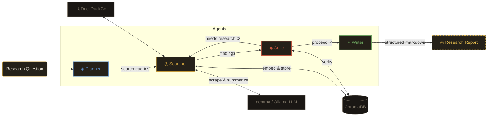

# Researcherman ◎

An autonomous multi-agent research system powered by Ollama that takes a research question, plans a search strategy, executes web searches, evaluates findings for credibility, and produces a structured markdown report. All processing happens locally — no data leaves your machine.

## Architecture



### Agent Roles

| Agent | Purpose | Output |
|-------|---------|--------|
| **◈ Planner** | Decomposes question into subtopics & search queries | JSON plan with scope assessment |
| **◎ Searcher** | DuckDuckGo search, web scraping, Ollama summarization, ChromaDB storage | Semantic findings with confidence tags |
| **◆ Critic** | Cross-examines findings for contradictions & weak sources | Verified claims, contradictions, confidence score |
| **✦ Writer** | Synthesizes everything into a polished report | Structured markdown with sources |

The Critic can loop back to the Searcher if findings are insufficient (max 1 retry).

## Project Structure

```
researcherman/
├── .env                    # Ollama URL, model config
├── requirements.txt        # Python dependencies
├── main.py                 # FastAPI backend + SSE streaming
├── venv/                   # Python virtual environment
├── README.md
│
├── agents/
│   ├── __init__.py
│   ├── planner.py          # ◈ Question decomposition
│   ├── searcher.py         # ◎ Web search & summarization
│   ├── critic.py           # ◆ Fact checking & validation
│   └── writer.py           # ✦ Report generation
│
├── core/
│   ├── __init__.py
│   ├── memory.py           # ChromaDB vector store wrapper
│   ├── orchestrator.py     # Agent pipeline manager
│   └── scraper.py          # BS4 web scraper
│
├── data/
│   ├── chroma_db/          # ChromaDB persistent storage (auto-created)
│   └── reports/            # Generated markdown reports (auto-created)
│
└── frontend/
    ├── index.html
    ├── vite.config.js
    ├── package.json
    └── src/
        ├── main.jsx
        ├── App.jsx
        ├── styles/index.css
        └── components/
            ├── QueryInput.jsx
            ├── AgentFeed.jsx
            ├── MemoryPanel.jsx
            └── ReportViewer.jsx
```

## Prerequisites

- **Python 3.10+**
- **Node.js 18+**
- **Ollama** running locally with required models:
  - `qwen2.5:3b` (default chat model — ~2GB, fits GPU)
  - `nomic-embed-text` (embedding model — ~274MB)

```bash
# Install Ollama (Linux/macOS)
curl -fsSL https://ollama.com/install.sh | sh

# Pull required models
ollama pull qwen2.5:3b
ollama pull nomic-embed-text

# Start Ollama
ollama serve
```

### Hardware Notes

Designed for **4GB VRAM** systems. The default model (`qwen2.5:3b`) runs fully on GPU (~2GB VRAM). Larger models like `mistral:7b` or `gemma4:e2b` will work with CPU/GPU offloading but are significantly slower due to partial CPU inference.

## Quick Start

```bash
# Activate virtual environment
cd researcherman
source venv/bin/activate    # Windows: venv\Scripts\activate

# Start the backend (port 8000)
python main.py

# In another terminal, start the frontend (port 3001)
cd frontend
npm run dev
```

Open **http://localhost:3001** in your browser. Enter a research question and hit **Initiate** ◎

## Configuration

All settings managed via `.env`:

| Variable | Default | Description |
|----------|---------|-------------|
| `OLLAMA_BASE_URL` | `http://localhost:11434` | Ollama API endpoint |
| `CHAT_MODEL` | `qwen2.5:3b` | LLM for reasoning & writing |
| `EMBED_MODEL` | `nomic-embed-text` | Embedding model for vector store |

Swap any supported Ollama model:

```bash
# Faster but weaker
CHAT_MODEL=gemma3:1b

# Reasonable balance (4GB+ GPU)
CHAT_MODEL=llama3.2:3b
```

## API Endpoints

| Method | Endpoint | Description |
|--------|----------|-------------|
| `POST` | `/research` | Submit a question → returns `session_id` |
| `GET` | `/stream/{session_id}` | SSE stream of agent activity |
| `GET` | `/report/{session_id}` | Get the final markdown report |
| `GET` | `/memory/{session_id}` | View stored ChromaDB findings |
| `DELETE` | `/memory/{session_id}` | Clear session memory |
| `GET` | `/health` | Check Ollama connectivity & model availability |

## Design

The frontend uses an **archival research terminal** aesthetic — warm paper tones, brass accents, CRT scanlines, and declassified document styling. Built with React, Vite, and Tailwind CSS. The terminal reports real-time agent activity via SSE and renders final reports with editorial typography.

## License

MIT
